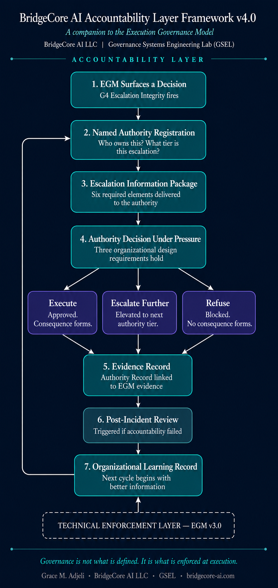

# Accountability Layer Framework v1.0

**BridgeCore AI, Governance Systems Engineering Lab (GSEL)**

*Governance is not what is defined. It is what is enforced at execution.*

---

> **v4.0 available.** This document is v1.0 of the Accountability Layer Framework, the foundational principles. 
> The full formal specification — Named Authority Registration, the Escalation Information Package, 
> pressure-resistance architecture, an adversarial escalation scenario, and post-incident review — is 
> published in [`ACCOUNTABILITY-LAYER-v4.0-DRAFT.md`](./ACCOUNTABILITY-LAYER-v4.0-DRAFT.md).
>
> 

---

## 1. Purpose and Problem Statement

A governance system can log every action perfectly. It can flag every violation instantly and produce an immutable audit trail. It can still fail if no human being is clearly, actively responsible for acting on what that system reports.

This is the gap the Accountability Layer Framework closes. The Execution Governance Model (EGM) defines and verifies the technical enforcement layer: mechanisms that mediate every action, adjudicate deterministically, fail closed, and generate immutable evidence. But evidence is not accountability. A perfect log of what happened is not the same thing as a clear answer to who is responsible for responding to it, and by when.

Organizations without this layer experience a specific, recognizable failure pattern. I call it accountability theater. A risk register exists. Owners are assigned. Dashboards get reviewed. And yet, in practice, ownership decays silently. Risks sit unresolved because no one followed up. Statuses go stale because no one closed the loop. The organization discovers the gap only after something has already gone wrong.

This framework exists to prevent that specific failure. It does not replace EGM's technical accountability mechanisms. It is the organizational structure that sits above them, consuming their evidence and converting it into real, enforced human action.

---

## 2. Relationship to the Execution Governance Model

EGM's Layer 3, the Accountability Layer, is a technical mechanism: immutable evidence generation, audit trails, and system level attribution of every enforcement decision. It answers the question: what happened, and can we prove it?

This framework answers a different question: who is responsible for acting on what happened, and how do we know they did?

The two layers work together. They are not redundant.

| | EGM Layer 3 (Technical) | Accountability Layer Framework (Organizational) |
|---|---|---|
| **Answers** | What happened? Can we prove it? | Who is responsible? Did they act? |
| **Mechanism** | Immutable logs, cryptographic attribution | Named roles, escalation paths, closure standards |
| **Failure mode it prevents** | Tampered or missing evidence | Silent ownership, stale status, unverified closure |
| **Nature** | Deterministic, machine verifiable | Organizational, process verifiable |

A system with strong technical evidence and weak organizational accountability produces perfect records of problems nobody acted on. A system with strong organizational accountability and weak technical evidence produces confident sounding decisions with no way to verify they were correct. You need both.

---

## 3. Core Principles

**1. Named Ownership.** Every control, risk, and enforcement decision has exactly one accountable individual. Never a committee. Never "the system." Never an unassigned queue. Shared ownership is unowned ownership.

**2. Escalation Clarity.** Every category of governance decision has a defined, time bound escalation path: who is notified first, what happens if they don't respond, and who holds final authority if escalation reaches its ceiling.

**3. Segregation of Duties.** The person who configures or operates a control is never the sole approver of exceptions to it. Verification of closure is performed by someone other than the person who did the work.

**4. Decision Rights.** Every governance activity, whether it's policy definition, enforcement configuration, incident response, exception approval, or audit review, has an explicit RACI assignment. Ambiguity about who decides is treated as a defect, not a detail.

**5. Traceable Accountability.** Every organizational decision links back to the technical evidence that triggered it. A closure, an exception, or an escalation without a corresponding evidentiary record is invalid by definition.

**6. Enforced Follow-Through.** Ownership is a standing obligation, not a one time assignment. Closure is a status that must be earned with evidence, not just declared. I built this principle around two specific failures I watched happen firsthand:

I sat on a Risk Advisory Board where the risk register regularly failed on follow-up. Risk owners went quiet, and the register never got updated because nothing forced a check-in. The fix: every open item needs a mandatory reporting cadence tied to its severity tier. Missing a reporting deadline is itself an escalation trigger. Silence is a signal, not a gap you wait out.

The second failure was just as common. Risk owners marked items "Closed" without meeting any real completion standard, and often with no notes on how the risk was actually resolved. The fix borrows directly from Definition of Done: no item moves to "Closed" without a resolution summary, the evidence that proves it, and sign off from someone other than the person who did the work.

"Closed" is not a status someone declares. It is a status someone earns by producing evidence.

---

## 4. The Accountability Structure Model

### 4.1 Defined Roles

| Role | Responsibility |
|---|---|
| **System Owner** | Accountable for the enforcement system's overall configuration and operation |
| **Control Owner** | Accountable for a specific control or risk item, from identification through verified closure |
| **Escalation Authority** | Receives escalations when an item breaches its response or reporting deadline |
| **Independent Reviewer** | Verifies closure evidence. Cannot be the same individual as the Control Owner for that item |
| **Executive Sponsor** | Final authority for exceptions and unresolved escalations. Accountable to the board or equivalent governing body |

### 4.2 RACI Matrix Template

| Activity | Control Owner | System Owner | Independent Reviewer | Executive Sponsor |
|---|---|---|---|---|
| Policy definition | C | A | I | R |
| Enforcement configuration | R | A | I | I |
| Incident response | R | C | I | A (if escalated) |
| Exception approval | C | R | C | A |
| Closure verification | I | I | R/A | I |
| Audit review | I | R | A | I |

*(R = Responsible, A = Accountable, C = Consulted, I = Informed)*

### 4.3 Escalation Path Model

Every open item moves through a defined chain, with a time bound at each stage:
DETECTION
|
v
FIRST RESPONDER  (Control Owner)
must acknowledge within [Tier defined window]
|  (no response by deadline)
v
ESCALATION TIER 1  (System Owner)
must act within [Tier defined window]
|  (unresolved by deadline)
v
ESCALATION TIER 2  (Escalation Authority)
|  (unresolved by deadline)
v
FINAL AUTHORITY  (Executive Sponsor)
decision is binding

Reporting cadence and escalation windows should be tiered by severity. For example, critical items report weekly with a 48 hour first response window, while moderate items report monthly with a 5 business day window. The specific intervals are your call. The requirement that intervals exist, are enforced, and trigger automatic escalation on breach is not optional.

### 4.4 Closure Standard

An item can only be marked "Closed" when all three of these are present:

1. A written resolution summary (what was done, not just that it was done)
2. The evidentiary artifact proving it (a remediated control, a signed exception, a completed fix, linked to the corresponding EGM evidence record where applicable)
3. Verification sign off from the Independent Reviewer, distinct from the Control Owner

Items missing any of these three stay open regardless of their working status.

---

## 5. Implementation Guidance

**Minimum viable version** (early stage organizations, including BridgeCore AI at its current size): one named accountable individual per major risk area, a simple severity tiered reporting cadence (even weekly self review is enough at small scale), and a closure checklist enforced by discipline rather than tooling. These principles don't require enterprise infrastructure to be real. They require that ownership, escalation, and closure standards are never skipped, even when the organization is one person.

**Mature version** (regulated enterprises): the same five roles staffed by distinct individuals, a governance platform or GRC tool enforcing reporting cadences and closure requirements programmatically, and Independent Review performed by a function organizationally separate from the Control Owner's reporting line. For example, a second line risk function reviewing first line control closures.

The framework scales by rigor of enforcement, not complexity of structure. A one person organization and a ten thousand person enterprise apply the same six principles. Only the tooling and staffing depth differ.

---

## 6. Appendix: Templates

**A. Blank RACI Matrix.** See Section 4.2 structure. Populate rows with your organization's specific governance activities.

**B. Escalation Path Worksheet.** For each severity tier, define: first response window, Tier 1 escalation window, Tier 2 escalation window, and final authority with a binding decision timeline.

**C. Role Description Card** (repeat per role):
- Role title:
- Accountable for:
- Reports to:
- Escalates to:
- Cannot also hold the role of: *(segregation of duties constraint)*

**D. Closure Checklist**
- [ ] Resolution summary written
- [ ] Evidentiary artifact attached
- [ ] Independent Reviewer sign off obtained (reviewer is not the Control Owner)
- [ ] Linked to corresponding technical evidence record (if applicable)

---

*BridgeCore AI. bridgecore-ai.com*
*This framework is published under the same commitment to rigor as the Execution Governance Model. Designed to be used, not just read.*
Select all of that and paste it into GitHub's README editor, replacing whatever placeholder text is there.
|
